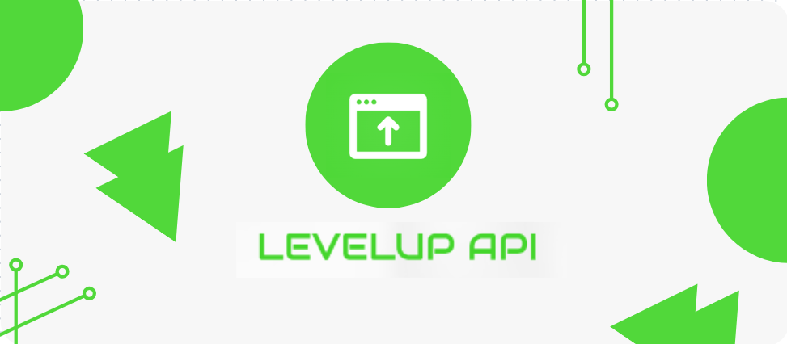

# LevelUp - API




## Índice

1. [Visão Geral](#visão-geral)
2. [Recursos](#recursos)
3. [Dependências](#dependências)
4. [Configuração do Ambiente](#configuração-do-ambiente)
5. [Instalação](#instalação)
6. [Uso](#uso)
7. [Estrutura do Projeto](#estrutura-do-projeto)
8. [Padrões de Codificação](#padrões-de-codificação)
9. [Swagger](#swagger)
10. [Contribuições](#contribuições)
11. [Licença](#licença)

---

## Visão Geral

Esta API foi desenvolvida em Node.js e utiliza o banco de dados MongoDB para armazenamento de dados. Ela se comunica com o banco via models definidos e documenta automaticamente os endpoints com o Swagger, evitando a necessidade de arquivos externos para schemas. A API foi criada com o objetivo de demosntrar meus conhecimento na construção deste tipo de aplicação e está organizada para facilitar o uso e o desenvolvimento contínuo, ela trás dados como se fosse uma loja de produtos gamers.

## Recursos

- **Node.js** para backend.
- **Express** como framework de servidor.
- **MongoDB** para armazenamento de dados.
- **Swagger** para documentação dos endpoints da API.
- Configurações específicas do `.gitignore` para manter o repositório limpo de arquivos desnecessários, como `node_modules` e configurações de IDE.
- **Padrões de Codificação** específicos para garantir consistência e clareza no código.

## Dependências

A API utiliza as seguintes dependências para garantir um funcionamento eficiente e seguro:

- **express**: Framework de servidor web que simplifica o desenvolvimento e gerenciamento de rotas.
- **body-parser**: Middleware para analisar o corpo das requisições, facilitando o tratamento de dados enviados pelo cliente.
- **mongodb e mongoose**: MongoDB é o banco de dados utilizado; o Mongoose facilita a interação com o MongoDB, fornecendo uma interface estruturada para o banco de dados.
- **joi**: Biblioteca para validação de dados, garantindo que as informações enviadas estejam no formato esperado.
- **jsonwebtoken**: Gera e valida tokens JWT, usado para autenticação e controle de acesso seguro na API.
- **md5**: Para criptografar informações como senhas de maneira básica.
- **nodemailer**: Biblioteca para envio de e-mails, útil para notificações e verificações de conta.
- **swagger-jsdoc e swagger-ui-express**: Integração do Swagger para gerar automaticamente a documentação dos endpoints com base nas anotações do código.
- **dotenv**: Carrega variáveis de ambiente a partir de um arquivo `.env`, permitindo que informações sensíveis como chaves de API e URI de banco de dados sejam armazenadas de forma segura.
- **nodemon** (devDependency): Monitora e reinicia automaticamente o servidor durante o desenvolvimento quando mudanças são detectadas.
- **debug**: Auxilia na depuração, permitindo registro condicional de informações de depuração para várias partes da aplicação.

## Configuração do Ambiente

1. **Node.js**: Certifique-se de ter a versão mais recente do Node.js instalada.
2. **MongoDB**: Instale e configure o MongoDB. Verifique o URI de conexão (`MONGODB_URI`) no arquivo `.env`.
3. **Variáveis de Ambiente**: Crie um arquivo `.env` na raiz do projeto com as seguintes variáveis:
   ```plaintext
   MONGODB_URI=mongodb://localhost:27017/meuBanco
   PORT=3000

## Instalação

1. Clone este repositório:
   ```bash
   git clone https://github.com/ed0101/sua-api.git
   cd sua-api
   ```

2. Instale as dependências:
   ```bash
   npm install
   ```

3. Inicie o servidor:
   ```bash
   npm start
   ```

## Uso

- **Rotas Principais**:
  - `GET /api/recursos`: Retorna todos os recursos.
  - `POST /api/recursos`: Cria um novo recurso.
  - `PUT /api/recursos/:id`: Atualiza um recurso pelo ID.
  - `DELETE /api/recursos/:id`: Exclui um recurso pelo ID.

Consulte a documentação Swagger para mais detalhes.

## Estrutura do Projeto

```plaintext
src/
├── config/
│   └── db.js            # Conexão com o banco de dados MongoDB
├── controllers/         # Controladores da API
├── models/              # Models do MongoDB (em letras minúsculas)
├── routes/              # Rotas da API
├── middleware/          # Middlewares para autenticação, validação, etc.
├── app.js               # Arquivo principal da aplicação
└── index.js             # Inicia o servidor
public/
├── img/
│   └── fundo.png        # Imagens estáticas
.gitignore               # Ignora node_modules e configurações do VS Code
```

## Padrões de Codificação

Todos os códigos seguem um padrão específico, mantendo consistência em nomeação, espaçamento e estrutura. Arquivos de models, por exemplo, estão em letras minúsculas.

## Swagger

A API utiliza Swagger para documentação automática dos endpoints, com os models diretamente integrados, eliminando a necessidade de um `schemas.json` externo.

- **Acessar a Documentação Swagger**: Após iniciar o servidor, vá para `http://localhost:3000/api-docs` para visualizar a documentação completa da API.

## Contribuição

Contribuições são bem-vindas! Siga as etapas de clonagem e instalação acima, e envie um pull request com suas sugestões.

## Licença

Este projeto é licenciado sob a [Licença MIT](LICENSE).
